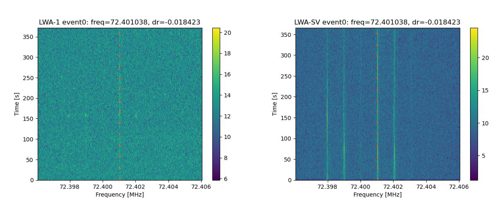

# comparingevents
This is a repository that hosts my SETI anti-coincidence event comparison script! See also the various other scripts I used for my research project (searching for narrowband technosignature signals using two LWA stations between 53-88 MHz). 

How the anti-coincidence method works: two telescope stations far enough apart from one another collect data from the same source simultaneously. Local RFI affecting a single station is ruled out - if a signal is found at one station and not the other, it is more likely to be local RFI (and vice versa). It also saves observing time - using the on-off method, half of all observing time is used to observe "secondary" targets.

## About setieventcomparison.py

This script takes in two .dat files outputted by turboSETI, each of which corresponds to data from a different telescope station from the same pointing - in my case, one file is from LWA-1 and the other is from LWA-SV. The code finds events (matching signals) between the two files according to certain parameters (default is up to 50 Hz frequency allowance for a signal between two stations, and the observed drift rates at both stations must be within 20% of one another). The user is alerted of potential events, and two tables are outputted, highlighting all instances of matching signals between two stations (with information such as frequency, drift rate, and SNR). For each event found, waterfall plots are generated to show what the signal of interest looks like at both stations (the x-axis by default is scaled such that the upper and lower limits are 0.005 MHz above and below the frequency of the signal of interest at t=0 s). The resulting two plots are saved to the current directory as a single .png file, and this process is repeated for every event. See an example of the waterfall plots below (fig. 1).

Two arguments are required to run this script: the first argument should be the path to the directory containing the two .dat files (one per LWA station), and the second argument should be the path to the directory containing the two corresponding .h5 files. These files can be in any order, as the script searches the two .csv files (one per LWA station containing information about each pointing and resulting data file) to put the files in order (LWA-1 first, LWA-SV second). This script was written with my specific data and research goals in mind, so many assumptions are made here (ex: all data files and directories follow a specific naming convention, paths to files and directories are hardcoded, LWA-1 and LWA-SV are the stations whose data is being analyzed, etc.).  

*Fig. 1: Example of an event .png file outputted by setieventcomparison.py. Both waterfall plots show the same signal as observed from different stations. The station name, event number, frequency, and drift rate are listed in the plot titles. A red dotted line is overlayed over the plots to better visualize the signal of interest.*
